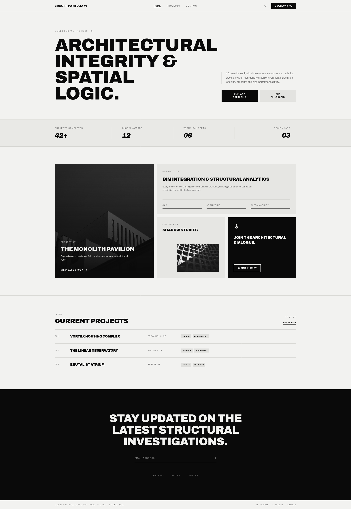
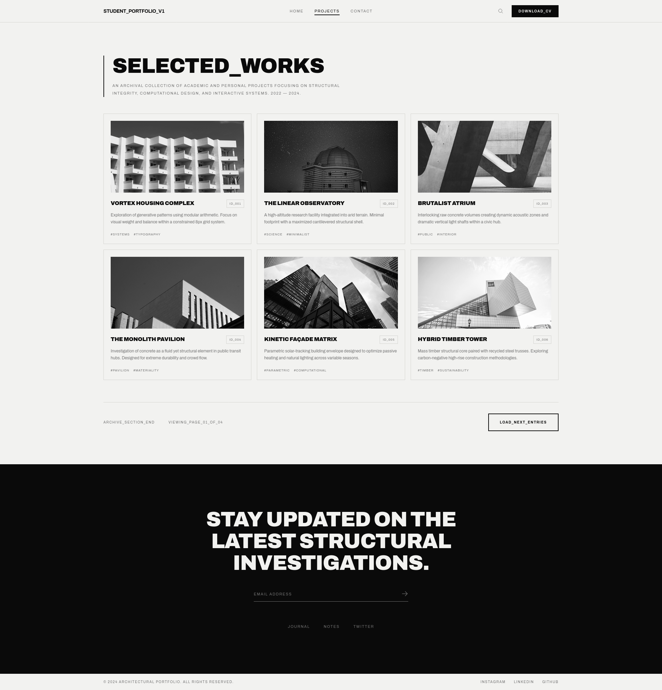
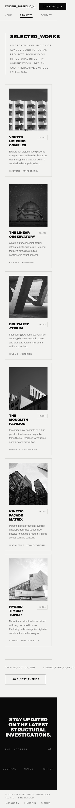

# Architect Portfolio — Tailwind Edition

A three-page architectural portfolio site built with Tailwind CSS v4, recreating a set of supplied wireframes as closely as possible. Built as the Tailwind CSS project for the ITonlinelearning Academy web development programme.

**Live site:** https://hossain-ahm.github.io/architect-portfolio-tailwind/



## Pages

| File | Contents |
|---|---|
| `index.html` | Asymmetric hero, statistics strip, methodology and project panels, current projects index |
| `projects.html` | Selected Works — six-card responsive archive grid |
| `contact.html` | Enquiry form and studio information column |

## Built with

- **Tailwind CSS v4** via the Play CDN (`@tailwindcss/browser@4`)
- **CSS Grid** and **Flexbox** for all layout — no absolute positioning used structurally
- Archivo (Google Fonts), a variable geometric grotesque
- Plain HTML — no build step, no framework

## Custom theme colours with `@theme`

Rather than scattering hex values through the markup, the palette is declared once in an `@theme` block inside a `<style type="text/tailwindcss">` tag:

```css
@theme {
  --color-ink: #0a0a0a;
  --color-paper: #f2f2f0;
  --color-hairline: #d4d4d0;
  --color-muted: #737373;
  --font-sans: "Archivo", ui-sans-serif, system-ui, sans-serif;
}
```

The `--color-*` prefix is what makes this work. Tailwind v4 reads that namespace and generates the whole family of utilities from each variable, so `--color-ink` produces `bg-ink`, `text-ink`, `border-ink`, `divide-ink`, and the rest — including opacity modifiers like `bg-hairline/40`. Naming it `--ink` would produce nothing.

Overriding `--font-sans` rather than adding a new font name means `font-sans` on `<body>` picks up Archivo automatically, with no extra utility needed.

The practical benefit is that the palette lives in one place. Adjusting the off-white background is a single edit rather than a find-and-replace across three files.

## A problem solved with CSS Grid

The hero section needed the headline block on the left, a narrower text-and-buttons column pinned to the right edge, and a deliberate empty gutter between them — with the right column bottom-aligned against the much taller headline.

Absolute positioning could place those elements, but only with hardcoded offsets that would need recalculating at every breakpoint and would break the moment the headline rewrapped. Grid derives the layout from the container instead:

```html
<div class="grid grid-cols-1 lg:grid-cols-12 gap-y-12 lg:gap-x-12">
  <div class="lg:col-span-7"> ... </div>
  <div class="lg:col-span-4 lg:col-start-9 flex flex-col gap-8 self-end"> ... </div>
</div>
```

The headline occupies columns 1–7. A four-column block would naturally flow into 8–11, leaving a dead column at the right edge — so `col-start-9` forces it to span 9–12 instead, pushing it flush right and leaving column 8 empty. That gap is the design, not an accident, and it holds at any viewport width because it is defined in grid tracks rather than pixels. `self-end` handles the bottom alignment without any knowledge of how tall the headline happens to be.

Dropping to `grid-cols-1` below `lg` collapses the whole thing to a single stacked column with no further work.

Grid solved a second, subtler problem in the Current Projects index. Four columns — number, title, location, tags — needed to align vertically across three rows with different title lengths. Flexbox lays out each row independently, so the columns would have been ragged; the only fix would have been hardcoding widths on all twelve cells. Declaring `grid-cols-[60px_400px_160px_1fr]` once on each row makes every row share the same track definition.

## Interaction

Every interactive element has a deliberate hover state with a Tailwind transition. The project cards use `group` / `group-hover` so a single hover drives three simultaneous changes — the card border darkens, the image moves from `grayscale` to full colour, and it scales slightly inside an `overflow-hidden` wrapper.

Keyboard focus states use `focus-visible` throughout, so the outline appears for keyboard navigation without showing on mouse clicks.

## Responsive design

Built mobile-first and tested at 375px, 768px, and 1440px. The project grid follows `grid-cols-1 md:grid-cols-2 lg:grid-cols-3`; the navigation splits into a second row below `md`; the statistics strip swaps its vertical dividers for row gaps at narrow widths, since `divide-x` applies borders in DOM order and would otherwise leave a stray line at the start of the second row.

| Desktop | Mobile |
|---|---|
|  |  |

## Running locally

```bash
git clone https://github.com/Hossain-ahm/architect-portfolio-tailwind.git
cd architect-portfolio-tailwind
```

Open `index.html` in a browser. No build step — Tailwind compiles in the browser via the Play CDN.

## Known tradeoffs

- **The Play CDN compiles at runtime.** Fine for a static learning project; a production build would use the Tailwind CLI or a bundler to ship only the classes actually used.
- **The header and footer are duplicated across all three files.** With no templating step there is no way to share them, so a change to the navigation means editing three files. A component framework or a static site generator would solve this.
- **The contact form has no backend.** It is markup only and does not submit anywhere.

## Credits

Photography from [Unsplash](https://unsplash.com). Icons from [Heroicons](https://heroicons.com).